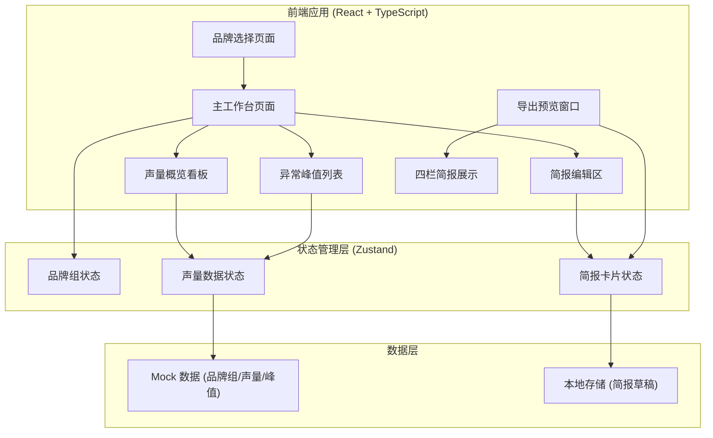
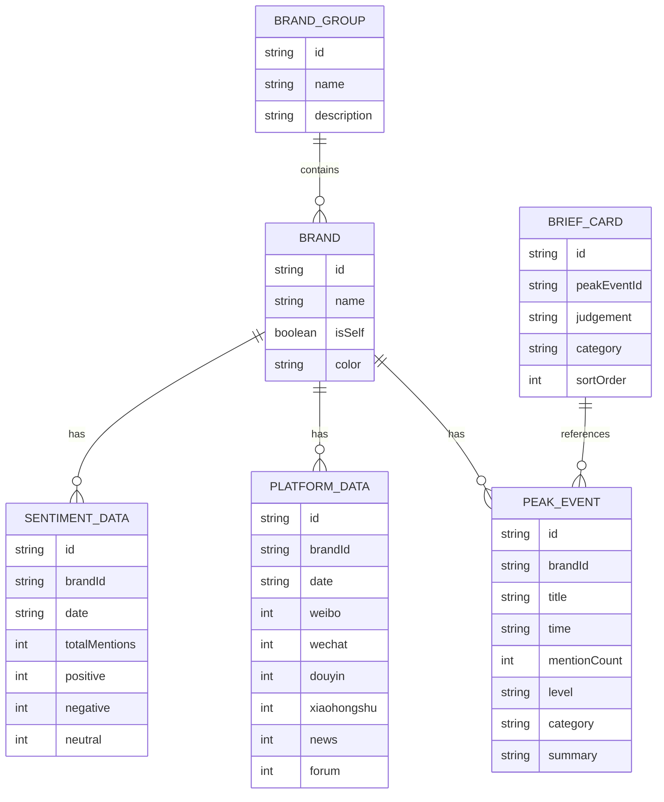

## 1. 架构设计



## 2. 技术描述

- **前端框架**：React 18 + TypeScript
- **构建工具**：Vite 5
- **样式方案**：TailwindCSS 3
- **状态管理**：Zustand
- **路由管理**：React Router DOM 6
- **图标库**：Lucide React
- **图表方案**：纯 CSS + SVG 实现（轻量级，无外部图表库依赖）
- **数据**：前端 Mock 数据，localStorage 持久化简报草稿
- **后端**：无（纯前端应用，桌面端可后续打包为 Electron）

## 3. 路由定义

| 路由 | 页面 | 功能 |
|------|------|------|
| `/` | 品牌选择页 | 选择所属品牌组，进入工作台 |
| `/dashboard` | 主工作台 | 声量概览 + 峰值列表 + 简报编辑 |
| `/export` | 导出预览 | 四栏简报全屏预览，支持打印/导出 |

## 4. 数据模型

### 4.1 数据模型定义



### 4.2 状态管理

使用 Zustand 管理三个核心 store：

1. **brandStore** - 品牌组与品牌信息
2. **dataStore** - 声量数据、平台分布、峰值事件
3. **briefStore** - 简报卡片编辑状态

## 5. 组件结构

```
src/
├── pages/
│   ├── BrandSelect/       # 品牌选择页
│   ├── Dashboard/         # 主工作台
│   └── ExportPreview/     # 导出预览
├── components/
│   ├── BrandSelector/     # 品牌选择器组件
│   ├── VolumeRanking/     # 声量排名柱状图
│   ├── SentimentChart/    # 情感分析环形图
│   ├── PlatformChart/     # 平台分布图
│   ├── PeakEventList/     # 异常峰值列表
│   ├── PeakEventCard/     # 峰值事件卡片（可拖拽）
│   ├── BriefEditor/       # 简报编辑区
│   ├── BriefCard/         # 简报卡片
│   └── ExportLayout/      # 导出四栏布局
├── store/
│   ├── brandStore.ts      # 品牌状态
│   ├── dataStore.ts       # 数据状态
│   └── briefStore.ts      # 简报状态
├── data/
│   └── mockData.ts        # Mock 数据
├── types/
│   └── index.ts           # 类型定义
├── utils/
│   └── helpers.ts         # 工具函数
├── App.tsx
├── main.tsx
└── index.css
```

## 6. 核心交互实现

### 6.1 拖拽功能
- 使用原生 HTML5 Drag and Drop API
- 峰值卡片作为 draggable 源
- 简报编辑区作为 drop 目标
- 拖拽时视觉反馈（透明度、阴影、边框高亮）

### 6.2 数据可视化
- 柱状图：CSS 渐变背景 + 宽度动画
- 环形图：SVG circle stroke-dasharray 实现
- 平台分布：横向条形图，品牌对比

### 6.3 导出功能
- 使用浏览器打印 API (`window.print`)
- 专门的打印样式表
- 四栏布局适配 A4 / 16:9 投影比例
